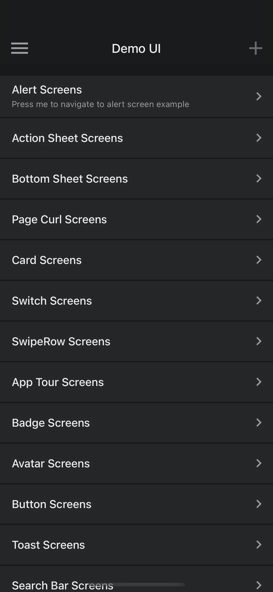
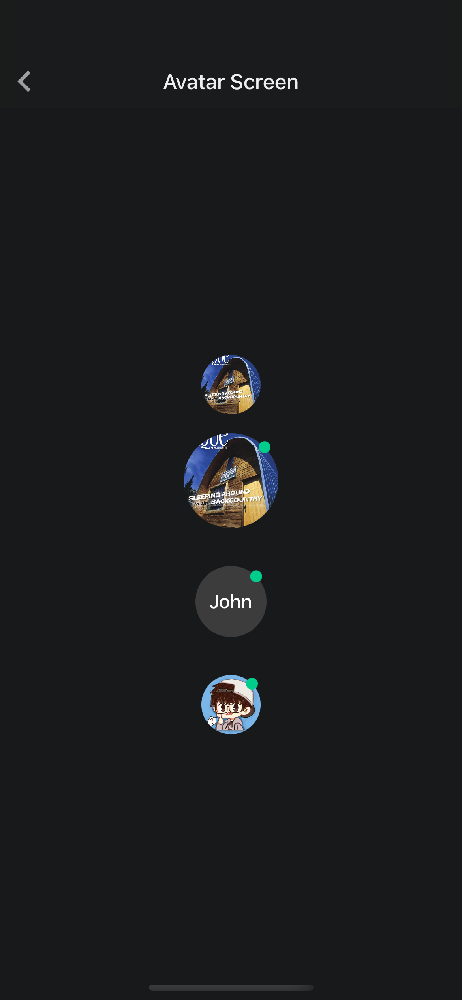
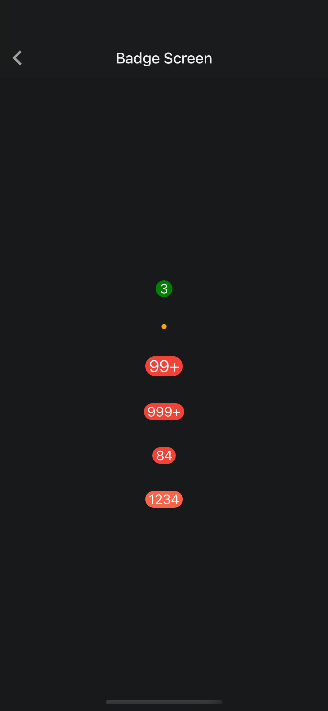
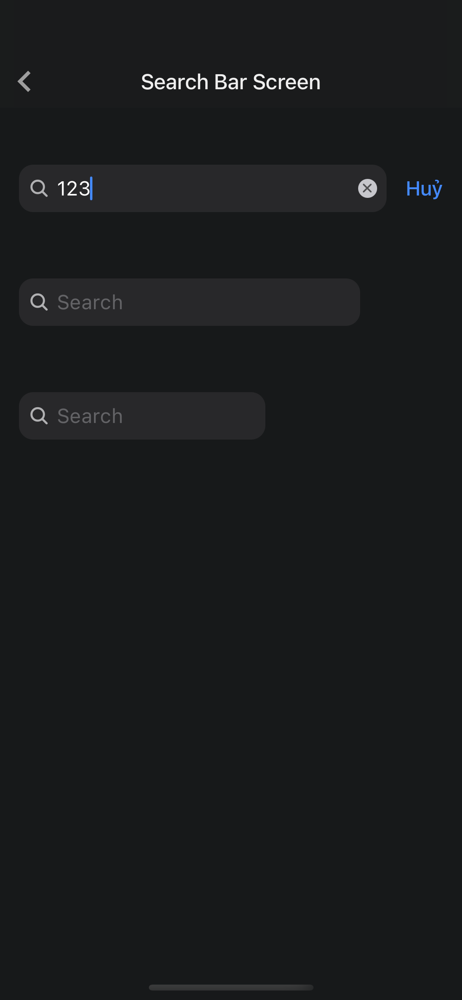
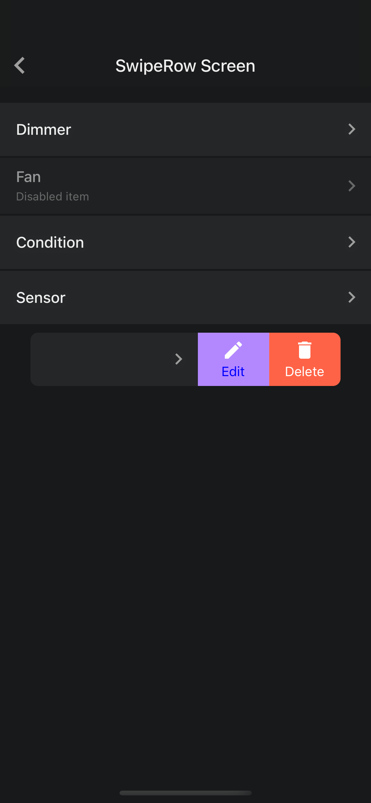
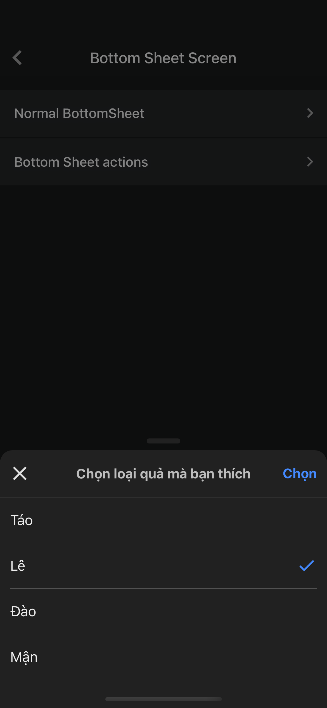
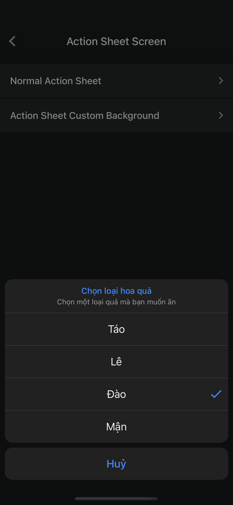
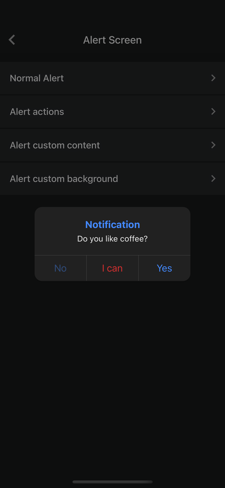

# @nghinv/react-native-design

React Native design Library

---

[](https://circleci.com/gh/nghinv-software/react-native-design)
[![Version][version-badge]][package]
[![MIT License][license-badge]][license]
[![All Contributors][all-contributors-badge]][all-contributors]
[![PRs Welcome][prs-welcome-badge]][prs-welcome]

<p align="center">








</p>

## Installation

```sh
yarn add @nghinv/react-native-design
```

or 

```sh
npm install @nghinv/react-native-design
```

- peerDependencies

```sh
yarn add react-native-gesture-handler react-native-reanimated react-native-fast-image @nghinv/react-native-badge @nghinv/react-native-search-bar @nghinv/react-native-services @nghinv/react-native-swipe-row @nghinv/react-native-switch @nghinv/react-native-theme @nghinv/react-native-animated
```

> IOS run `cd ios && pod install`

## Usage

1. Wrapper `ThemeProvider` with `Root` Component

```js
import { 
  ThemeProvider, 
  DarkTheme, 
  LightTheme, 
  Colors, 
  ThemeType,
  ServiceProviderWithTheme,
} from '@nghinv/react-native-design';

const black: ThemeType = {
  ...DarkTheme,
  background: Colors.black,
  drawerBackground: Colors.black,
  card: 'rgba(255, 255, 255, 0.1)',
  shadowColor: 'black',
};

const purple: ThemeType = {
  ...LightTheme,
  background: Colors.deepPurple800,
};

function App() {
  return (
    <ThemeProvider
      themes={{
        purple,
        black,
      }}
      themeMode='dark'
    >
      <ServiceProviderWithTheme>
        <RootComponent />
      </ServiceProviderWithTheme>
    </ThemeProvider>
  );
}
```

2. Use hook `useTheme`

```js
import React from 'react';
import { View, Text, ScrollView } from 'react-native';
import { useTheme, ThemeMode } from '@nghinv/react-native-design';

function App() {
  const { theme, themeMode, setThemeMode } = useTheme();

  return (
    <View 
      style={[
        styles.container, 
        { backgroundColor: theme.drawerBackground }
      ]}
    >
      <Text 
        style={[
          theme.textStyles.h0, 
          { marginLeft: 16, marginBottom: 8 }
        ]}
      >
      Set theme
      </Text>
      <ScrollView>
        {
          ['Default', 'Light', 'Dark', 'Black', 'Purple'].map(themeKey => (
            <Row
              key={themeKey}
              title={`${themeKey} theme`}
              containerStyle={{ 
                marginBottom: 2, 
                marginHorizontal: 16, 
                borderRadius: 4 
              }}
              backgroundColor={themeMode === themeKey.toLowerCase() ? theme.selected : undefined}
              onPress={() => {
                setThemeMode(themeKey.toLowerCase() as ThemeMode)
              }}
            />
          ))
        }
      </ScrollView>
    </View>
  );
}
```

3. Use `Component`

```js
import {
  Divider,
  Space,
  SizeBox,
  Container,
  NavBar,
  Row,
  Card,
  Text,
  Switch,
  EnvironmentBanner,
  SwipeRow,
  Badge,
  Avatar,
  Button,
  SearchBar,
  ServiceProviderWithTheme,
} from '@nghinv/react-native-design';
```

---
## Credits

- [@Nghi-NV](https://github.com/Nghi-NV)

[version-badge]: https://img.shields.io/npm/v/@nghinv/react-native-design.svg?style=flat-square
[package]: https://www.npmjs.com/package/@nghinv/react-native-design
[license-badge]: https://img.shields.io/npm/l/@nghinv/react-native-design.svg?style=flat-square
[license]: https://opensource.org/licenses/MIT
[all-contributors-badge]: https://img.shields.io/badge/all_contributors-1-orange.svg?style=flat-square
[all-contributors]: #contributors
[prs-welcome-badge]: https://img.shields.io/badge/PRs-welcome-brightgreen.svg?style=flat-square
[prs-welcome]: http://makeapullrequest.com
